# NetApp

Brian McKean, a senior engineer at NetApp, gave a talk about his company in class.
He shared a data problem for our class to help solve.

# Tool
Tableau

# Authors

This report is prepared by
* [Kari Santos](https://github.com/karisantos)
* [Heather Witte](https://github.com/hswitte)
* [Zachary Lamb](https://github.com/ZachLamb)
* [Fadhil Suhendi](https://github.com/fadhilfath)
* [Denis Kazakov](https://github.com/94kazakov)

# How many of the delta times are "good"? Which SW releases and FW releases are responsible for "bad" delta times? (by Kari)

Ideally delta times are near 24 hours. While it's possible to consider delta times above or below 24 hours, the data may be suspect. These charts helps the user decide what delta times should be used, and which FW and SW vversions are causing the most "bad" delta times, and good delta times. 

This bar chart shows how many records there are for certain bins of time. The bin sizes vary in delta time length in order to capture where the delta times are (and where they are not). Maybe more art than science!  The same bins are used in all three visualizations. The colors show that all 3 releases contribute to both good and bad delta times.
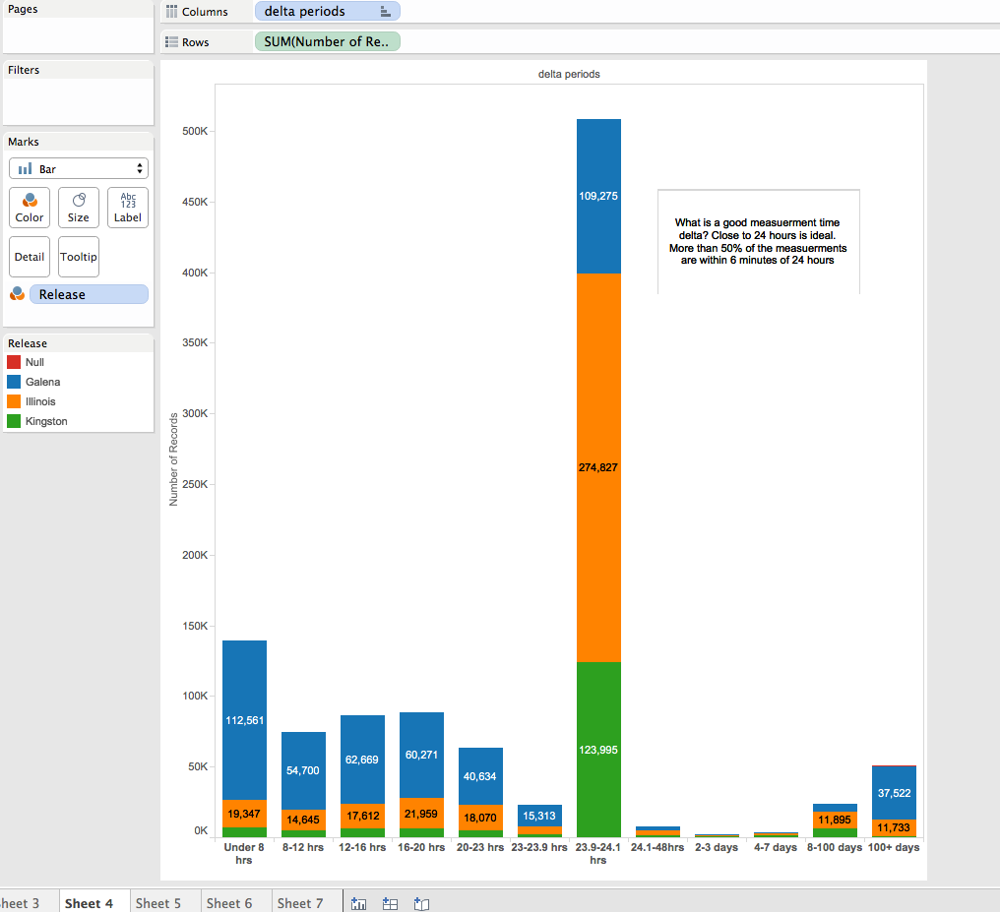
The next two charts attempt to determine how certain SW releases and Firmware releases contibute good and bad delta times.  The rows are sorted by total number of records for a given release, descending.

The top row shows that 1 software version contributed the most bad delta times under 24 hours. But really all SW versions contributed bad delta times both less than and more than the ideal 24 hours.
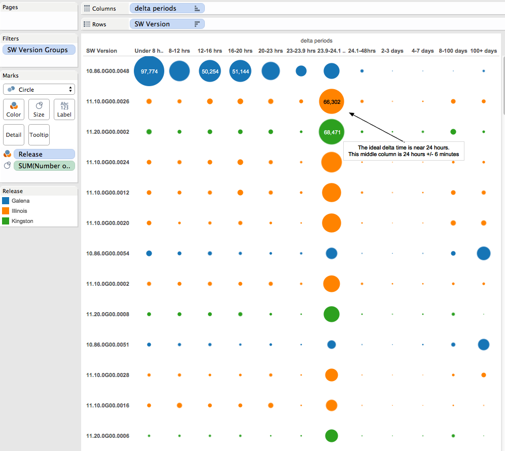
For firmware versions, the results are similar. The top 2 rows show 2 FW versions that contributed the majority of low bad values. The third row is an FW version that contributes most of the bad high delta times.  The following rows show FW versions that produce a majority of good time values, but all versions produce bad delta times. 
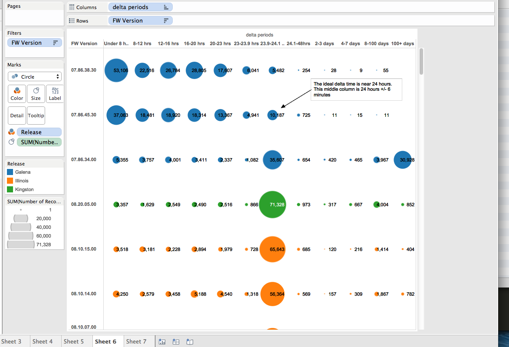

# How can the non-incrementing basetime bug be visualized? (by Heather)

I wanted to visualize the relation between basetime and observation time. Given ideal data, this plot should create a diagonal line, where basetimes and observation times are almost perfectly correlated. With a plot of observation time on the x-axis and basetime on the y-axis, systems with non-incrementing basetimes would appear as horizontal stripes on this graph. 

Here is the first plot I made, including all datapoints:
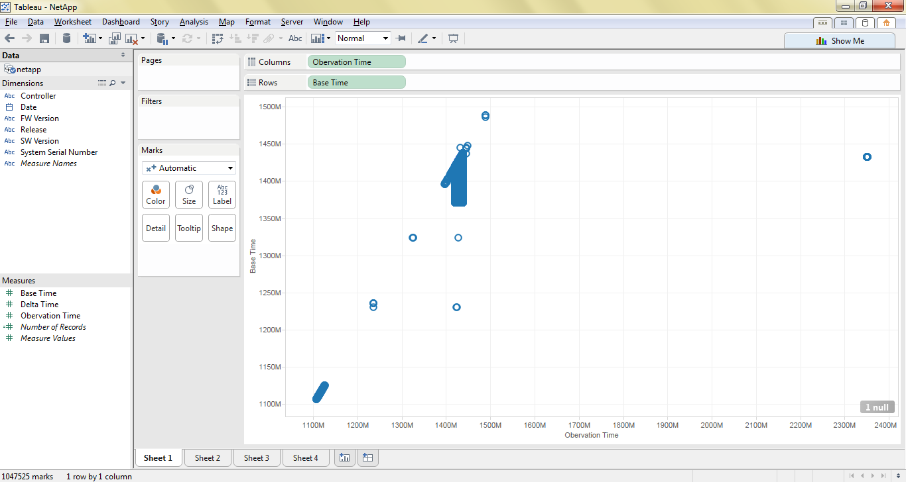

The data for the time frame we are interested in is the blue blob in the middle. The outlying timestamps correspond to dates in 2005 (in the lower left corner) and 2017 (in the upper right corner). Filtering to include only the points whose observation times correspond to the dates contained in the file produces the following chart: 
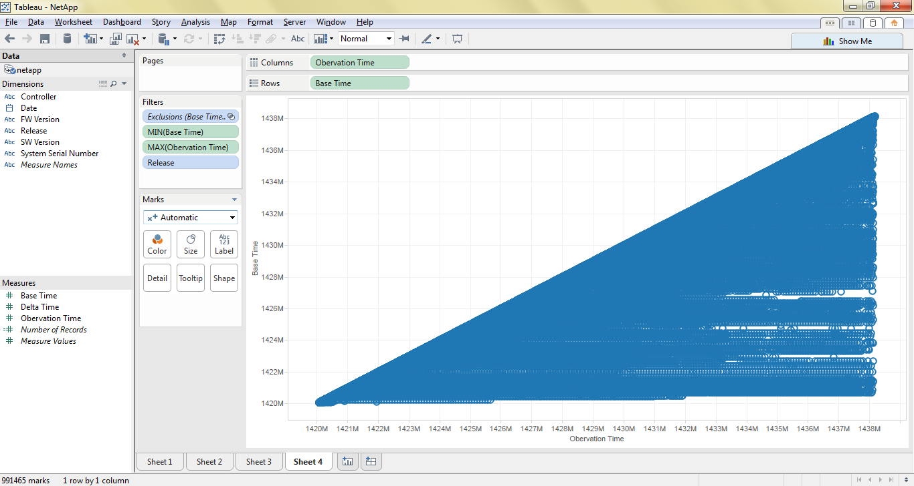

From this chart you can see that there are many instances of basetimes not incrementing appropriately (evidenced by horizontal-stripes that you can see (kind of) in this graph).

Supposed, this bug has been fixed, but the following series of graphs, which filter on release, show that basetimes are still not incrementing in the latest release (Kingston).

Galena:
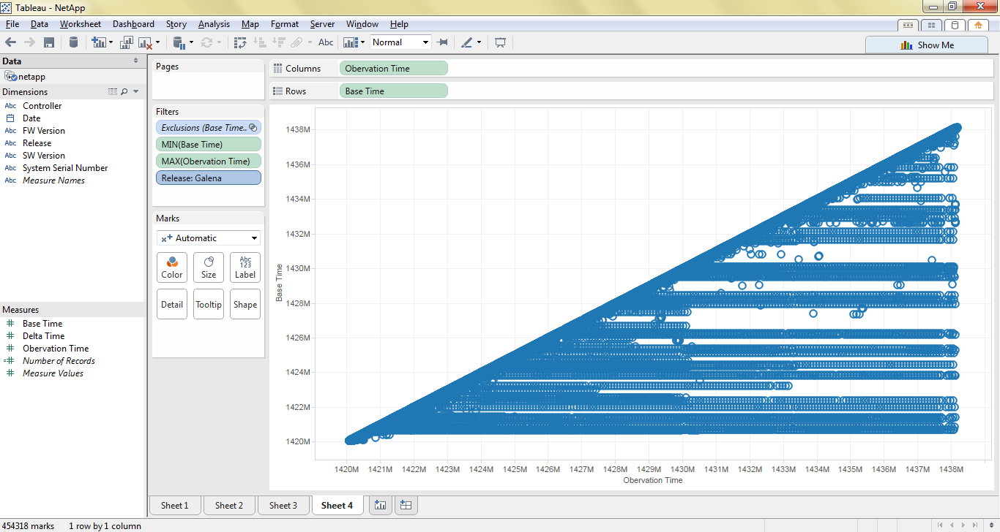

Illinois:
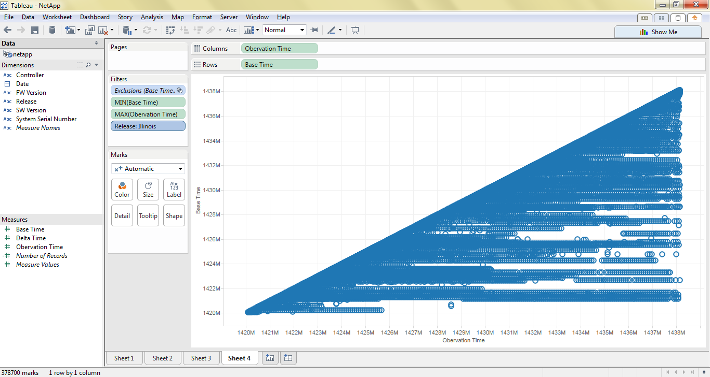

Kingston:
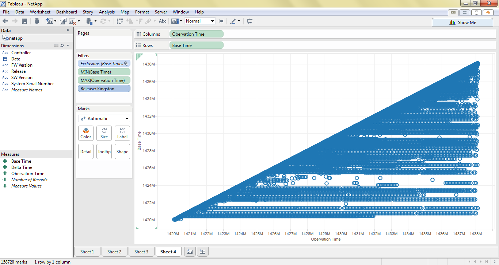

# From the dataset, can we pinpoint when the so called software fix for the Base Time attribute was implemented? (by Zach)

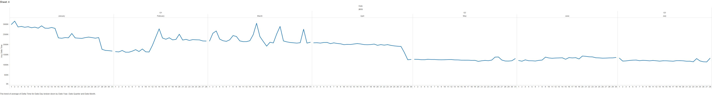

# What is the duration of observation times? (by Denis)

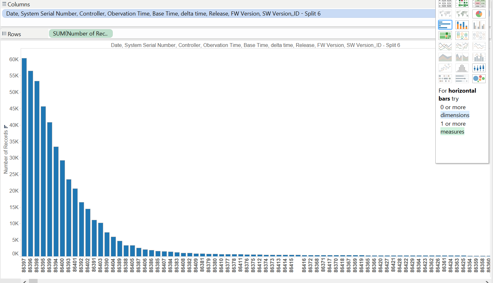

# Which software version has the delta time in range of 24 - 25 hours? (by Fadhil)

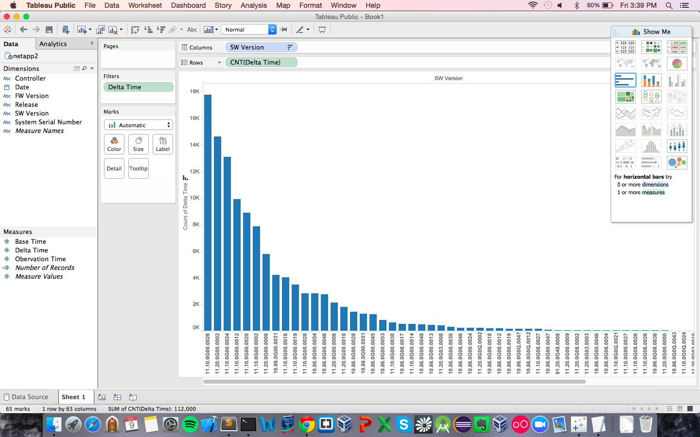

# Further Analysis

Our team determines the following questions are too complex for Tableau and
require custom scripts to be written.

* Re-calculating delta times based on non-incrementing basetimes, and utilizing that calculation as a new statistic.
